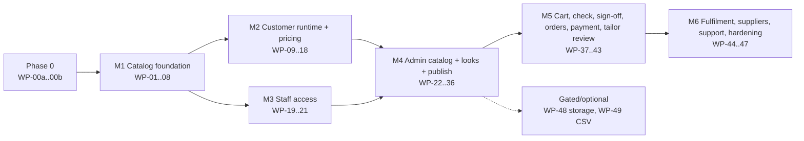

# Implementation plan: admin catalog, commerce and fulfilment (D-019, D-020)

Status: ready for execution, 2026-09-28. This plan splits TASK-015 to TASK-027 into **51 work packages (WP-00a, WP-00b, WP-01 to WP-49)**, each sized to be built, reviewed and merged as **one pull request**. It adds no requirements. Every package points at its canonical spec. When this plan and a spec disagree, the spec wins; fix the plan in the same PR.

Authority: implementation is authorised by D-019 and D-020 (DECISIONS.md). Items marked “proposed” in the specs (tracking statuses, sign-off wording, commerce placeholders) may be built as specified. They remain subject to confirmation before **customer release**, not before implementation.

## 1. How to use this plan

- Take the lowest-numbered package whose dependencies are merged. Packages in different tracks (§4) can run in parallel.
- Before starting, read AGENTS.md, the parent TASK file and every spec section the package cites. Do not work from this summary alone.
- One package is one branch and one PR (`wp-05-legacy-importer`), with the title `WP-05 (TASK-015): Legacy importer and lookup seeds`. If a package grows beyond **L**, stop and split it, and record the split here.
- The PR description lists the requirement IDs touched, the commands run with their results, screenshots for UI work, and known limitations (AGENTS.md “Verification and completion”).
- When the **last** package of a task merges, update that TASK file’s “Actual verification evidence”, TRACEABILITY.md (status and evidence), STATUS.md and TEST-EVIDENCE.md.

### Size scale

| Size | Scope | Planning effort |
| --- | --- | --- |
| **S** | One small module or config change; up to about 300 changed lines | ≤ 0.5 day |
| **M** | One backend slice, or one screen, with its tests | 1–2 days |
| **L** | Several modules, or a complex screen, with full tests | 2–4 days |

These are planning estimates for one focused agent or developer, including tests and review fixes. They are not commitments.

### Definition of Ready (every package)

1. Its dependencies are merged and `npm run check` is green on `master`.
2. The cited spec sections exist, and there are no unresolved contradictions (raise them before coding).
3. The fixtures it needs exist, or creating them is in its scope.

### Definition of Done (every package)

1. `npm run check` passes (typecheck, lint, Vitest, build), and `npm run test:e2e` passes for UI or route changes. Nothing is skipped or weakened; existing assertions are ported, not deleted (AGENTS.md).
2. The new tests listed under “Tests” exist and pass. Fixtures are synthetic and labelled `SYNTHETIC`.
3. Any migration is idempotent, safe for the semicolon split, listed in `MIGRATIONS`, and mirrored in `src/db/schema.ts`. `tests/migrations.test.ts` passes.
4. No new runtime dependency (the only exception is WP-48, after approval). No live keys, real customer data or outbound customer messages.
5. UI packages: screenshots were inspected at the required viewports (customer 1440/768/390/320; admin 1440/1024/768, plus 390 for the order desk), with a keyboard-only pass and an axe check without new violations.
6. The PR description holds the evidence. A task-completing package also updates the evidence documents listed above.

## 2. Phase 0 — readiness (before any feature code)

| # | Readiness item | Owner | Needed by |
| --- | --- | --- | --- |
| R1 | Confirm that this plan and the D-019/D-020 specs are the baseline to build from | Product owner (user) | WP-01 |
| R2 | Node 22, `npm ci`, `npx playwright install chromium`; a clean `master` (the untracked `.claude/` stays out of commits) | Developer or agent | WP-00a |
| R3 | Optional: `OPENAI_API_KEY` + `OPENAI_MODEL` for live assistant and advisory evaluation. Without them the code paths run in `not_configured` or guided mode, and CI does not need them | Product owner | WP-16, WP-38 (manual evaluation only) |
| R4 | Optional: Stripe **test-mode** keys (`sk_test_…`) and a test webhook secret for a manual sandbox run. CI uses the fake provider | Product owner | WP-42/43 sandbox evidence |
| R5 | Recommended: TASK-002 (isolated Replit staging with hosted PostgreSQL) before any external demo of the admin panel | Technical owner | Before the M4 demo |
| R6 | Release-only inputs, which never block development: Q-011 real catalog data, Q-018 tailor staffing, Q-019 commerce and live payments, Q-022 mail provider, Q-024 storage, Q-025 staff recovery, Q-030 tracking statuses, Q-032 sign-off wording and AI data scope, Q-033 tailor-review fee | Product, operations and legal owners | Customer release |

### WP-00a · Baseline verification and shared test helpers — S
- **Task/spec:** AGENTS.md; CURRENT-SYSTEM.md.
- **Build:** run and record `npm run check`, `npm run test:e2e` and `npm run format:check` on `master`. Add `tests/helpers/db.ts` (a PGlite temp-directory database per test file, following `repository.test.ts`), `tests/helpers/http.ts` (a `NextRequest` builder with an `Origin` header, cookies and a JSON body, to call route handlers directly) and `tests/helpers/users.ts` (synthetic user and session creation through Better Auth in the test database).
- **Tests:** a smoke test for each helper.
- **Done when:** the baseline results are recorded in TEST-EVIDENCE.md and the helpers are used by one existing test.

### WP-00b · Golden visual outputs (before any renderer change) — M
- **Task/spec:** TASK-016 step 1; CATALOG-ADMIN §6; AC-43.
- **Depends on:** WP-00a.
- **Build:** `tests/golden/generate.ts` builds a synthetic design matrix: suit defaults plus every value of every seed section applied one at a time, and shirt and blazer with every legacy option. It records `sketchSpec()`, `regionForLeaf()` for every leaf and `shownIn3D()` for every leaf into `tests/golden/*.json`. `tests/golden.test.ts` compares the current output with the goldens.
- **Done when:** the goldens are committed and the test passes on the unchanged code. **Rule for later packages:** a golden may be regenerated only with written justification in the PR and an explicit reviewer sign-off. Never regenerate one just to make a failing test pass.

## 3. Milestones and packages

| Milestone | Packages | Demonstrable outcome | Planning effort |
| --- | --- | --- | --- |
| Phase 0 | WP-00a–00b | Green baseline; goldens locked | 1.5–2.5 days |
| M1 | WP-01–08 | `npm run catalog:bootstrap` creates catalog v1 from today’s data. No customer change | 10–20 days |
| M2 | WP-09–18 | The studio runs entirely from the published release; visuals are identical; prices show “Price not yet available” until priced | 14–28 days |
| M3 (parallel with M2) | WP-19–21 | A staff owner signs in with TOTP and sees the admin shell; roles are enforced | 4–8 days |
| M4 | WP-22–36 | Admins edit products, options, fabrics, suppliers, prices and looks, then preview and publish. Customers start from a look and see live prices | 20–40 days |
| M5 | WP-37–43 | Cart → check → sign-off → place order → pay (fake provider or Stripe test mode) → optional tailor review with the customer’s decision | 11–22 days |
| M6 | WP-44–47 | The order desk assigns suppliers and deadlines, releases and tracks orders; support lookup; full-journey hardening | 6–12 days |

Total planning effort is roughly 67–133 focused days for a single stream. Running the parallel tracks in §4 shortens the calendar time.

### M1 — Catalog foundation (TASK-015)

#### WP-01 · Migration 0003, Drizzle mirror, audit writer and migration tests — M
- **Spec:** ADMIN-BACKEND §4.1, §2 (Audit); CURRENT-SYSTEM “Migration mechanics”.
- **Depends on:** WP-00a.
- **Build:** `migrations/0003_catalog.sql`, verbatim from §4.1; add it to `MIGRATIONS`; mirror every table in `src/db/schema.ts`; add `src/db/audit.ts#writeAudit(query, event)`.
- **Tests:** `tests/migrations.test.ts`: every migration file survives the `;` split into whole `CREATE|ALTER|INSERT` statements; all migrations run twice on one PGlite directory without error; constraint smoke tests (super-number multiple of 10, usage allowlist, hex format, one default per attribute, unique product-setting target, template slug). These checks were already run against the spec DDL.
- **Done when:** a fresh and a re-started development database both come up, and the existing tests are unaffected.

#### WP-02 · Canonical JSON and money utilities — S
- **Spec:** PRICING PRC-001; ADMIN-BACKEND §1.
- **Build:** `src/lib/canonical-json.ts` (sorted-key serialisation plus sha256); `src/lib/money.ts` (`parseMoney`, `formatMinor`, the `SUPPORTED_CURRENCIES` exponent-2 allowlist).
- **Tests:** `"0"`, `"0.5"` → 50, `"1299.00"` → 129900; rejects `"1,000"`, `"12.345"`, negatives and values over 10,000,000; key-order independence of the checksum.

#### WP-03 · Snapshot contract and condition language — M
- **Spec:** ADMIN-BACKEND §5; CATALOG-ADMIN §5.1–5.2.
- **Depends on:** WP-02.
- **Build:** `src/modules/catalog/snapshot.ts` (Zod for `CatalogSnapshot` and `CustomerCatalog`, exported types, a code index builder); `conditions.ts` (`evaluateCondition`, and `validateCondition` with depth ≤ 6, ≤ 50 nodes and unknown-code detection); `tests/fixtures/catalog.synthetic.ts` (a small SYNTHETIC suit, shirt and blazer snapshot covering every condition type and the PRICING E1–E7 fixture data).
- **Tests:** every operator, nesting, the limits, and unknown codes; the fixture parses.

#### WP-04 · Visual slot registry — M
- **Spec:** CATALOG-ADMIN §6; TASK-015 step 4.
- **Depends on:** WP-00b.
- **Build:** `src/visualization/registry.ts`, with `VISUAL_SLOTS` (one slot per selection key read in `sketch-spec.ts`, `tailored-human.tsx`, `garments/*.ts`, `focus-regions.ts` and `coverage.ts`; the tokens are the seed values for that key plus the literals compared in code, such as `simple_5` and `relaxed`; `shownIn3D` from `coverage.ts`; `visualModels`) and `REGION_IDS`. No renderer behaviour changes.
- **Tests:** each registry token for a key appears in the seed or in the code literals; every seed value of a bound key is a token; every `LEAF_REGIONS` value is a `RegionId`.

#### WP-05 · Legacy importer and lookup seeds — L
- **Spec:** CATALOG-ADMIN §3.8, §10; ADMIN-BACKEND §5.
- **Depends on:** WP-03, WP-04.
- **Build:** `src/modules/catalog/import-legacy.ts`, a pure `importLegacyCatalog()` that returns a `CatalogSnapshot` plus the system lookup seeds. It covers: products and part links (including “Add a vest”); the components; groups and attributes with seed codes, readable labels, focus regions and accessory line kinds; values with cleaned labels, `metadata.referencePrice`/`sourceLabel`, `is_off` and defaults; visibility conditions derived from `relevantSections`/`visibleGroups`; archived placeholder groups; vest inclusion replacing the waistcoat attribute; the shirt groups; the blazer product settings; the `relaxed` jacket-fit value; the 8 fabrics as materials (null weight and composition, with the label metadata kept); static media rows; `reference_only` on everything; and the bindings from the registry.
- **Tests:** twice → identical checksum; all 434 seed values present (plus the added shirt and fit values); every attribute code equals its seed `selectionKey`; every binding resolves; `validateRelease` (WP-07) reports no errors, only the expected warnings (`price_missing`, `reference_only_present`, `rights_unconfirmed`, `supplier_missing`, `image_missing`).

#### WP-06 · Compile working copy and load snapshot into the working copy — L
- **Spec:** CATALOG-ADMIN §7.1–7.2, §7.5; ADMIN-BACKEND §5.
- **Depends on:** WP-01, WP-03.
- **Build:** `compile.ts` (active rows → snapshot; sorting; resolved product settings; the template list; checksum excluding the version and publish time); `db/catalog-admin-repository.ts` read functions (`loadWorkingRows`); `loadSnapshotIntoWorkingCopy(query, snapshot, actor)` (upsert by code, keeping existing ids, and archiving rows missing from the snapshot).
- **Tests:** import → load → compile gives the same checksum as the import (round trip); loading twice is a no-op; draft and archived rows are excluded from the compile.

#### WP-07 · Release validation, customer projection and diff — L
- **Spec:** CATALOG-ADMIN §7.4, §9, §7.5.
- **Depends on:** WP-03, WP-04.
- **Build:** `validate-release.ts` (every error and warning code, a `warningsChecksum`, entity references for badges); `projection.ts` (the strip list, plus a size assertion); `diff.ts` (added, removed and changed, with field names, keyed by code).
- **Tests:** one failing fixture per error code and per warning code; the projection contains none of the stripped fields; diff cases for add, remove and field change.

#### WP-08 · Release repository, bootstrap script and readiness check — M
- **Spec:** CATALOG-ADMIN §7.3; ADMIN-BACKEND §6; TASK-015 steps 7–9.
- **Depends on:** WP-05, WP-06, WP-07.
- **Build:** `db/release-repository.ts` (`publish` under advisory lock 731851 with `expectedCurrentVersion`, warning acknowledgement, `nothing_to_publish`, `first_published_version` stamping and audit; `getCurrentVersion`; the `getRelease` LRU; `ensureCatalog` with `CATALOG_AUTO_BOOTSTRAP`; `restoreToWorkingCopy`); `scripts/catalog-bootstrap.ts` plus the `catalog:bootstrap` package script; the `/api/ready` catalog check; the `.env.example` entry.
- **Tests:** bootstrap creates v1 with `reference_only`; re-running is a no-op; concurrent publishes → one gets `stale_release`; `nothing_to_publish`; restore v1 then publish gives v2 with the same checksum; production mode without a release → 503 `catalog_unavailable` and ready `not_ready`.
- **M1 exit:** the catalog exists in the database with deterministic content, and the customer app is unchanged.

### M2 — Customer runtime on releases and pricing (TASK-016, TASK-017)

#### WP-09 · Catalog structure engine — M
- **Spec:** CATALOG-ADMIN §2.1, §4, §5.2.
- **Depends on:** WP-03.
- **Build:** `structure.ts`: `defaultsFor(product)`; `effectiveSelections` (a fixed point of at most 10 passes, where hidden selections become inert); `visibleStructure` (Essentials, part tabs and Accents, with the single-part flattening and product-setting availability).
- **Tests:** vest groups appear only when the vest is included; gating by `personalizado` and off values; shirt and blazer tabs flatten into Essentials; the cycle limit; product settings hide and re-default correctly.

#### WP-10 · Garment patch, validation and rebase — L
- **Spec:** CATALOG-ADMIN §5.3, §7.8; ADMIN-BACKEND §7.1 (`Impact`, error codes).
- **Depends on:** WP-09.
- **Build:** `garment.ts`: `applyGarmentPatch` (product, material, preferences, components, selections and text rules; impact lists for rule-driven changes); `validateGarment`; `rebaseGarment(from, to)`.
- **Tests:** each error code (`unavailable_option`, `incompatible_fabric`, `invalid_text`, `impact_confirmation_required`, `category_confirmation_required`); forbid and require rules; rebase that keeps, replaces or removes selections; an empty impact list when nothing breaks.

#### WP-11 · Draft v2 types and deterministic v1 upgrade — M
- **Spec:** ADMIN-BACKEND §7.1–7.2.
- **Depends on:** WP-03.
- **Build:** `configuration/types.ts` (`DraftV2`, `Garment`, `garmentPatch`, `commandSchemaV2`; the `review` command kept as today); `configuration/upgrade.ts`.
- **Tests:** a table-driven test for every row of §7.2, using v1 fixtures built from today’s `createDraft()` for suit, shirt and blazer plus edited variants; the upgrade is idempotent on v2; garment id = draft id.

#### WP-12 · Engine v2 and repository upgrade on read — L
- **Spec:** ADMIN-BACKEND §7.1; CRT-001–004; TASK-016 steps 4–5.
- **Depends on:** WP-08, WP-10, WP-11.
- **Build:** `engine.ts` v2 (`add_garment`, `remove_garment`, `select_garment`, `design`, `set_quantity`, `accept_design`, `rebase_catalog`, `appearance`, `measurements` using the union of required fields, `review` as today); auto-rebase on stale garments; `repository.ts` upgrades `drafts`, `actions` and `revisions` on read; new drafts start with no garments; `requiredDefinitionsForProducts`.
- **Tests:** port every assertion in `configuration.test.ts` and `repository.test.ts` to v2 (the PR lists the old → new mapping); garment switching isolation; the removal confirmation; the 10-garment limit; replay of a v1 action result upgrades correctly.

#### WP-13 · Public catalog and media routes; studio response shape — M
- **Spec:** API-REFERENCE §2.2–2.3; ADMIN-BACKEND §6, §9 (static driver only).
- **Depends on:** WP-12.
- **Build:** `/api/catalog/current`; `/api/catalog/v/[version]` (immutable cache headers); `/api/media/[id]` (308 for static media); `db/availability.ts` (60-second overlay); `GET` and `POST /api/studio` return `{draft, catalogVersion, catalogUpdates, quote: null placeholder, availability}`.
- **Tests:** route tests for headers, 404 on an unknown version, and the absence of stripped fields; `catalogUpdates` computed for a stale garment.

#### WP-14 · Visual binding refactor (goldens must match) — L
- **Spec:** CATALOG-ADMIN §6; AC-43.
- **Depends on:** WP-00b, WP-12.
- **Build:** `visualization/binding.ts#renderValues`; refactor `sketch-spec.ts`, `tailored-human.tsx`, `garments/*`, `focus-regions.ts` (reads `group.focusRegion`) and `coverage.ts` (derived from slots) to read render values instead of raw selection keys.
- **Tests:** `golden.test.ts` is identical with **no golden changes**; a choice without a token produces the “not illustrated” flag.

#### WP-15 · Outline and studio UI on the customer catalog — L
- **Spec:** TASK-016 steps 6 and 8; CATALOG-ADMIN §2.1; UX-004/005/013.
- **Depends on:** WP-13, WP-14.
- **Build:** rewrite `design-outline.ts` on the snapshot (same shapes; leaf id = group code); `use-studio.ts` loads the `CustomerCatalog`; the navigator, tags, consultation and review panel use it; a minimal **Choose a garment** start screen; the impact confirmation dialog; the catalog-update dialog; the “Not illustrated” marker.
- **Tests:** port `design-outline.test.ts`; port `tests/e2e/studio.spec.ts` and `human-preview.spec.ts` (start screen → suit → same flows); screenshots at 1440/768/390/320; keyboard pass.

#### WP-16 · Assistant grounded in the release — M
- **Spec:** ADMIN-BACKEND §11; AI-001–006.
- **Depends on:** WP-12.
- **Build:** a new response schema (`kind/key/value`); a bounded developer context; dry-run validation through `applyGarmentPatch` (invalid suggestions dropped); guided mode matching lookup labels; a suggestion on an empty cart → `add_garment` + `design`.
- **Tests:** a stubbed model returning unknown codes, instruction text in a catalog description, an incompatible fabric and valid multi-intent output; guided-mode keyword cases. Manual live evaluation only with R3 keys, recorded as such.

#### WP-17 · Pricing engine — M
- **Spec:** PRICING PRC-002–005; TASK-017.
- **Depends on:** WP-09.
- **Build:** `pricing/quote.ts` (`quoteGarment`, `quoteCart`, `byCategory`); `pricing/explain.ts`.
- **Tests:** PRICING E1–E7 exactly; override precedence; hidden-inert selections; a default value with its own surcharge; text activation; `unavailable` reasons; quantity.

#### WP-18 · Customer price display — M
- **Spec:** ADMIN-SCREENS §4 (S-02, S-03), §5; UX-013.
- **Depends on:** WP-15, WP-17.
- **Build:** `quote` in studio responses; garment price and cart total; a **Price details** disclosure; “+$X” on choices; “Customising adds $Y” in group headers; “Price not yet available”; `review.ts` derives the quote finding from the actual quote.
- **Tests:** e2e with a SYNTHETIC priced release inserted into the test database (breakdown matches E3); the unavailable copy with imported data; screenshots at 1440/390.
- **M2 exit:** the studio behaves as before on database data, the goldens are identical, prices display correctly, and all ported tests are green.

### M3 — Staff access (TASK-018; can run in parallel with M2 after WP-01)

#### WP-19 · Staff roles, MFA schema and authorisation core — M
- **Spec:** ADMIN-BACKEND §3, §4.2.
- **Depends on:** WP-01.
- **Build:** `migrations/0004_staff.sql`; Drizzle `staffRoles`, `twoFactor` and `user.twoFactorEnabled`; enable the Better Auth `twoFactor` plugin (issuer “Vessy”); `modules/staff/permissions.ts` (the matrix); `authorize.ts` (`getStaffContext`, `requireStaff`, `mfaRequired`).
- **Tests:** the permission matrix; `requireStaff` for no session (401), non-staff (403), missing MFA when required (403 `mfa_required`) and allowed; an existing customer without 2FA still signs in.

#### WP-20 · Staff endpoints, CLI grant and admin HTTP helpers — M
- **Spec:** API-REFERENCE §3.1; ADMIN-BACKEND §2 (errors, body limits, rate limits), §3.3.
- **Depends on:** WP-19.
- **Build:** `scripts/staff-grant.ts` plus the `staff:grant` script; `/api/admin/me`, `/api/admin/staff`, `/api/admin/staff/grants` and `/revocations`, `/api/admin/audit`; the `body(request, {maxBytes})` option; `validation_failed` with field paths for admin routes; admin rate-limit keys.
- **Tests:** grants refused for unverified users; `last_owner`; audit rows written in the same transaction; the matrix enforced for each endpoint (API-REFERENCE §4).

#### WP-21 · Admin shell, MFA enrolment and TOTP sign-in — L
- **Spec:** ADMIN-SCREENS §1–2, §3.1, ADM-01 (skeleton), ADM-17 (Staff and Audit tabs).
- **Depends on:** WP-20.
- **Build:** `app/admin/security` (QR, manual key, verify, backup codes); `app/admin/(guarded)/layout.tsx` (redirect, 404 for non-staff, MFA redirect); a permission-filtered sidebar; the publish-bar placeholder; ADM-01 with static tiles; the ADM-17 Staff and Audit tabs; the TOTP challenge step in the account sign-in UI.
- **Tests:** e2e: grant owner by CLI → sign in → enrol TOTP (the code computed in the test) → admin visible; a non-staff user gets 404; keyboard pass; screenshots at 1440/1024/768.
- **M3 exit:** secure staff access exists with an empty admin.

### M4 — Admin catalog, fabrics, suppliers, pricing, looks and publishing (TASK-019 to TASK-021)

#### WP-22 · Storage adapters, media upload and lookup endpoints — M
- **Spec:** ADMIN-BACKEND §9; API-REFERENCE §3.2; CAT-016.
- **Depends on:** WP-01, WP-20.
- **Build:** `integrations/storage/{index,local,static}.ts` (local rejected in production); the streaming multipart upload with magic bytes, dimensions, sha256 deduplication, alt text and rights; `/api/admin/media` (POST, GET, PATCH); local serving in `/api/media/[id]`; the lookup endpoints.
- **Tests:** SYNTHETIC tiny PNG, JPEG and WebP accepted; a spoofed extension, SVG, an oversized file and bad dimensions rejected with specific errors; serving headers (`immutable`, `nosniff`, CSP); lookup code immutability after publish.

#### WP-23 · Catalog admin repository, part 1: products, components, links, product settings — M
- **Spec:** API-REFERENCE §3.4 (first half); CATALOG-ADMIN §3.1–3.2, §4, §7.1–7.2.
- **Depends on:** WP-08, WP-20.
- **Build:** shared mutation helpers (a row-version update, audit, `code_immutable` after first publish, `entity_published`/`entity_in_use` on delete); product, component, link and settings services and endpoints.
- **Tests:** `stale_row_version` with `details.current`; code immutability; delete versus archive; settings target uniqueness; the audit summary contains no personal data.

#### WP-24 · Catalog admin repository, part 2: groups, options, choices, rules — L
- **Spec:** API-REFERENCE §3.4 (second half); CATALOG-ADMIN §3.3–3.6, §5.3.
- **Depends on:** WP-23.
- **Build:** group, attribute and value CRUD (the default swap in one transaction; generated value codes; metadata validation against `metadata_fields`); `values/bulk` (all or nothing); `reorder`; group `duplicate`; the rules CRUD; `rules/evaluate` against the working copy or the current release.
- **Tests:** a single default per attribute; bulk rollback on a single failure; a deep copy on duplicate; evaluate reports violations and impact.

#### WP-25 · Working-copy validation badges and product tree endpoint — M
- **Spec:** CATALOG-ADMIN §7.4; API-REFERENCE §3.4 (`tree`, `badges`); ADM-004.
- **Depends on:** WP-24, WP-07.
- **Build:** a working compile and validation cached by working checksum; badge mapping per entity; `GET …/products/{id}/tree` with effective availability, defaults and surcharges.
- **Tests:** a badge appears on the right node and clears after a fix; the effective values honour product overrides.

#### WP-26 · ADM-02 tree editor: tree and detail panels — L
- **Spec:** ADMIN-SCREENS ADM-02, §1 principles 1–4, 8–10.
- **Depends on:** WP-21, WP-25.
- **Build:** the product switcher; an accessible tree (WAI-ARIA tree pattern) with badges and status chips; product, part-link, group and option panels with save and discard; dirty guards; the stale-row reconciliation dialog; the effective-price explanations from `explain.ts`.
- **Tests:** e2e: edit a group name and surcharge, then reload and see it persisted; the conflict dialog path; keyboard-only tree navigation; screenshots at 1440/1024/768.

#### WP-27 · ADM-02 choice grid, per-product overrides, condition builder and bulk tools — L
- **Spec:** ADMIN-SCREENS ADM-02; CATALOG-ADMIN §4, §5.1.
- **Depends on:** WP-26.
- **Build:** the choice grid (image, default radio, None flag, surcharge, supplier code, **Draws as** token picker, status); a bulk bar; Move up/down and Move to…; “This product only” overrides with chips; a condition-builder component (All/Any/Not, attribute/part/fabric rows, a plain-English summary).
- **Tests:** e2e: add a group with two choices and a “show when” condition, then see the badges update; bulk surcharge; keyboard reorder with focus retained.

#### WP-28 · ADM-03 rules, ADM-06 lists and ADM-19 media library — M
- **Spec:** ADMIN-SCREENS ADM-03, ADM-06, ADM-19.
- **Depends on:** WP-22, WP-24, WP-26.
- **Build:** the rules list and editor with a **Try it** panel; the lists screen (system types undeletable; deactivation with a usage count); the media grid with upload (drag area and file button), alt text and rights editing.
- **Tests:** e2e for one rule, one lookup value and one upload; axe; keyboard.

#### WP-29 · Suppliers backend and ADM-15/16 (details and contacts) — M
- **Spec:** ORDERS-FULFILLMENT §8 SUP-001–003; API-REFERENCE §3.3.
- **Depends on:** WP-20, WP-21.
- **Build:** the supplier repository and endpoints (contacts per rank; primary required when active; code immutability once referenced); the ADM-15 list and ADM-16 details (the Fabrics and Assigned-items tabs show placeholders until WP-30/WP-46).
- **Tests:** SYNTHETIC suppliers with example.com contacts; validation of email, phone and country; the primary-contact rule; contacts absent from audit summaries.

#### WP-30 · Materials backend — M
- **Spec:** CATALOG-ADMIN §3.7, §7.6–7.7; API-REFERENCE §3.5 (materials).
- **Depends on:** WP-22, WP-23, WP-29.
- **Build:** material CRUD with lookup and composition validation; the live `availability` endpoint (it busts the overlay cache); media roles; price overrides; bulk; duplicate; `clear-reference-only` with the exact confirmation text and audit.
- **Tests:** a composition sum other than 100 is rejected at publish but savable as draft; unknown lookups; an availability change is visible to `getAvailability` (and immediately at submission via the no-cache path); clear-reference-only needs `catalog.publish`.

#### WP-31 · ADM-04 fabric list and ADM-05 fabric editor — L
- **Spec:** ADMIN-SCREENS ADM-04, ADM-05.
- **Depends on:** WP-30, WP-21.
- **Build:** the filterable grid with bulk actions (with a live-availability confirmation); the sectioned editor (composition rows with a running total, g/m² ↔ oz/yd² conversion, colour pickers with hex, character counters, media roles with alt text, a price preview per product, the live availability card, the reference-only banner).
- **Tests:** e2e: create a SYNTHETIC fabric with a swatch and composition, then save as active and see its badges clear; keyboard pass through every section; screenshots.

#### WP-32 · Pricing, commerce settings, ADM-07 and ADM-17 Commerce — M
- **Spec:** PRICING PRC-001–003; API-REFERENCE §3.1 (settings), §3.5 (pricing); ADMIN-SCREENS ADM-07, ADM-17.
- **Depends on:** WP-17, WP-30.
- **Build:** the bands and band-price endpoints; the simulator (the same `quoteGarment`, on the working copy or the current release); the commerce settings with `currency_locked`; the ADM-07 matrix with `parseMoney` inputs and a “Not priced” state; the simulator panel; the ADM-17 Commerce tab with the “unconfirmed placeholder” flags.
- **Tests:** simulator output equals E1–E7; a band in use cannot be removed; currency is editable while no orders exist (the `currency_locked` test is added in WP-39, once orders exist).

#### WP-33 · Looks (templates) backend and ADM-08/09 — L
- **Spec:** CATALOG-ADMIN §8 TPL-001–004; API-REFERENCE §3.6.
- **Depends on:** WP-32, WP-27.
- **Build:** template CRUD, media (exactly 1 hero and ≤ 8 gallery images), duplicate, working price and violations; ADM-08 cards; the ADM-09 editor reusing the customer navigator in working-copy mode, with a live 2D preview and “As shown” price.
- **Tests:** an invalid template shows the rule message; `asShownPriceMinor` is computed at publish (WP-34); screenshots.

#### WP-34 · Publish workflow and ADM-10 — M
- **Spec:** CATALOG-ADMIN §7.3–7.5; API-REFERENCE §3.7; ADMIN-SCREENS ADM-10.
- **Depends on:** WP-25, WP-21.
- **Build:** the status, validate, diff, publish, release list and detail, snapshot download and restore endpoints; the ADM-10 stepper (Check → Changes → Publish), history and restore; the live publish bar in the shell.
- **Tests:** blocked by errors; warnings acknowledgement with a stale checksum rejected; `nothing_to_publish`; restore then publish; e2e publish of a label change that the customer then sees.

#### WP-35 · Staff preview of the working catalog — M
- **Spec:** CATALOG-ADMIN §7.5 (Preview); ADM-006; API-REFERENCE §2.2.
- **Depends on:** WP-34, WP-15.
- **Build:** `GET/POST /api/studio?catalog=working` (staff only, owner `preview:user:<id>`); a preview banner in the studio; **Preview as customer** deep links from ADM-02 and ADM-09; `templates/from-preview`.
- **Tests:** preview never modifies customer drafts; a non-staff user asking for `?catalog=working` gets 403; save-as-look creates a draft template.

#### WP-36 · Customer look gallery (S-01) and catalog update banner — M
- **Spec:** ADMIN-SCREENS §4 (S-01, S-02 banner); TPL-003/004.
- **Depends on:** WP-33, WP-15, WP-18.
- **Build:** the start screen gallery (a tab per product, featured first, “As shown $X” or “Price not yet available”, tags, **Customise this look**, **Start from scratch**); the catalog-update banner and impact flow.
- **Tests:** e2e: publish a look → it appears → customise → the price is recomputed → archive and republish → the customer garment is unchanged (TPL-003); screenshots at 1440/768/390/320; keyboard.
- **M4 exit:** an admin can build, price and publish; the customer starts from looks with live prices.

### M5 — Cart, automated check, sign-off, orders, payment and tailor review (TASK-022 to TASK-024)

#### WP-37 · Multi-garment cart UI — L
- **Spec:** ORDERS-FULFILLMENT CRT-001–004; ADMIN-SCREENS §4 (S-02, S-08 sections).
- **Depends on:** WP-18, WP-36.
- **Build:** the cart switcher chips with prices; an add-garment dialog reusing S-01; remove with confirmation; a quantity stepper; measurement-union messaging; per-garment review sections with cart totals; chat targeting the active garment.
- **Tests:** e2e: a suit and two shirts, with switching isolation, removal, quantities, union of measurements and totals; screenshots at 1440/390; keyboard.

#### WP-38 · Migration 0005, check policy, `/api/studio/check` and AI advisory — L
- **Spec:** ORDERS-FULFILLMENT §2.1; ADMIN-BACKEND §4.3, §7.1 (`OrderCheck`), §11 (advisory); REV-002–004; D-020.
- **Depends on:** WP-37, WP-16.
- **Build:** `migrations/0005_orders.sql`; `orders/check-policy.ts` (blocking and advice findings); `assistant.ts#adviseOrderCheck` (20 s, advice only, no measurement values); the order-repository `runOrderCheck` (idempotent by `actionId`); `POST /api/studio/check`; remove the `review` command; the S-08 **Check my order** UI (blocking findings with field links; advice; “Advice unavailable right now” copy); any edit clears the check.
- **Tests:** a stubbed AI trying to block or approve → advice only; an AI timeout → `aiAdvisory:'unavailable'` and the check still passes; blocking cases; a stale check after an edit; migration tests updated.

#### WP-39 · Sign-off, order submission, resubmit and cancel — L
- **Spec:** ORDERS-FULFILLMENT §2.2, §3, §5 (ORD-009/010); REV-009; ADMIN-BACKEND §8; API-REFERENCE §2.4.
- **Depends on:** WP-38, WP-20.
- **Build:** `orders/submission.ts` (checks 1–11 in order; the snapshot builder with `check` and `signoff`; item spec without measurements); the order-repository submit, resubmit and cancel functions (numbering, quote, items, snapshot, the `awaiting_payment` case, events); `/api/orders` POST, resubmit and cancel; the S-08 sign-off checkboxes, the **Add a tailor review** option and **Place order and pay $X** (checkout is chained in WP-42).
- **Tests:** each check and error code; a missing or outdated sign-off; the stored sign-off fields; idempotent replay and a concurrent double submit giving one order; the snapshot unchanged after a new publish (AC-17); resubmit v2 cancels the `awaiting_payment` case; cancel rules; `PATCH /api/admin/settings/commerce` returns 409 `currency_locked` once an order exists (from WP-32).

#### WP-40 · Customer orders pages and notification outbox — M
- **Spec:** ORDERS-FULFILLMENT ORD-011, §9, FUL-004 (labels); API-REFERENCE §2.4 (GET).
- **Depends on:** WP-39.
- **Build:** `GET /api/orders` and `GET /api/orders/{number}`; `orders/customer-status.ts`; `/orders` and `/orders/[number]` (tracks, timeline including the sign-off, spec, measurements, actions); `notifications` writes in the same transaction; `notifications/dispatch.ts` using `mail.ts` (`.data/mail` in development).
- **Tests:** another user’s order returns 404; notification deduplication; a dispatch failure does not change order state; screenshots at 1440/390.

#### WP-41 · Tailor review: backend, ADM-13/14 and customer response — L
- **Spec:** ORDERS-FULFILLMENT §4; REV-005–007; API-REFERENCE §2.4 (respond), §3.8 (reviews); ADMIN-SCREENS ADM-13, ADM-14, S-09/S-13.
- **Depends on:** WP-40.
- **Build:** `orders/tailor-review.ts` (the state table); the repository `openOnPayment(orderId)` (called by WP-43); claim, decision and respond; the amendment snapshot (item rows untouched; `current_snapshot_version` incremented); overdue computation and the single delayed notification; the admin review endpoints; the ADM-13 queue and ADM-14 decision form; the customer proposal view with **Accept** / **Keep my measurements**.
- **Tests:** every allowed and denied transition; `changes_proposed` validation (ids and bounds); accept → v2 amendment, keep → v1 stands; overdue without completion; `measurementsVerified` only with `no_changes`; e2e using `openOnPayment` directly (the real payment arrives in WP-43).

#### WP-42 · Migration 0006, payment adapter and checkout endpoint — M
- **Spec:** ORDERS-FULFILLMENT §6 PAY-007/008; ADMIN-BACKEND §4.4, §10; API-REFERENCE §2.5.
- **Depends on:** WP-39.
- **Build:** `migrations/0006_payments.sql`; `integrations/payments/stripe-orders.ts` (a normalised interface only) and `fake.ts` (test-only; throws in production); `payment-repository.ts`; `POST /api/orders/{number}/checkout` (the guard matrix; reuse or reconcile a pending session); chain checkout after **Place order and pay**; the `.env.example` additions.
- **Tests:** the guard matrix (missing key, live key outside production, production without `PAYMENTS_LIVE_ENABLED`); one open session per order; `quote_expired`; checkout works without any tailor approval.

#### WP-43 · Webhook reconciliation, paid states and stub removal — M
- **Spec:** ORDERS-FULFILLMENT §6 PAY-009; PAY-003/004; AC-28, AC-40.
- **Depends on:** WP-41, WP-42.
- **Build:** `POST /api/payments/stripe/webhook` (signature, livemode, `metadata.kind` filter, deduplication, amount and currency checks → `needs_attention`, transitions, `openOnPayment` for a requested tailor review, the `payment_received` notification); the order page “confirming” polling; `POST /api/checkout` → 410 `endpoint_removed`; update the old e2e expectation; remove `integrations/checkout.ts`.
- **Tests:** events signed with `stripe.webhooks.generateTestHeaderString`: completed, async success and failure, expired after completed (no regression), duplicate, forged, livemode mismatch, amount mismatch; the tailor review opens exactly once. Full e2e with the fake provider. Optional sandbox run with R4 keys, recorded as sandbox evidence.
- **M5 exit:** a complete purchase journey with an optional tailor review, in test mode only.

### M6 — Fulfilment, suppliers, support and hardening (TASK-025)

#### WP-44 · Fulfilment state machine and admin order endpoints — L
- **Spec:** ORDERS-FULFILLMENT §7 FUL-001–005; API-REFERENCE §3.8 (orders).
- **Depends on:** WP-43, WP-29.
- **Build:** `orders/fulfillment.ts` (the transition table; the release guard including the tailor-review status; derived order status); the admin order list, detail, snapshots, assignment (per item and for all items), transition, release, ETA, notes, attention-clear and notification-retry endpoints; redacting measurements without `orders.measurements.read`.
- **Tests:** every allowed transition plus one denied transition per state; release refused while a tailor review is open and allowed without one; `supplier_inactive`; deadline history with required reasons; overdue in the operations timezone; support redaction.

#### WP-45 · ADM-11 order desk, ADM-12 order detail and live dashboard tiles — L
- **Spec:** ADMIN-SCREENS ADM-01, ADM-11, ADM-12.
- **Depends on:** WP-44.
- **Build:** the saved-filter tabs, the table and 390px card layout; the detail tabs (Summary with sign-off, Specification with version history, Measurements, Tailor review, Payment, Fulfilment with allowed-next-step buttons and self-explaining guards, Activity); live ADM-01 tiles.
- **Tests:** e2e: assign a supplier and deadline → release → in production → quality check → ship with tracking → delivered; screenshots at 1440/768/390; keyboard pass of ADM-12.

#### WP-46 · Production sheet, supplier items, support lookup and customer tracking — M
- **Spec:** FUL-004, FUL-006; SUP-004; ADMIN-SCREENS ADM-16 (items tab), ADM-18; API-REFERENCE §3.3 (items), §3.8 (customers, production sheet).
- **Depends on:** WP-45.
- **Build:** the production sheet in HTML (print CSS) and JSON, using the current snapshot measurements, sign-off date and amendment or verified note; the supplier Assigned-items tab; `/api/admin/customers` and the ADM-18 screens; customer tracking labels and the carrier link on the order page.
- **Tests:** the sheet equals the snapshot data (ORD-005) and shows the amended values after an accepted tailor proposal; support never receives measurement values; customers never see supplier identity.

#### WP-47 · End-to-end hardening and release-readiness evidence — M
- **Spec:** AGENTS.md “Verification and completion”; SECURITY-RELEASE OPS-001/005; ACCEPTANCE AC-34 to AC-46.
- **Depends on:** WP-46.
- **Build:** one Playwright journey covering admin publish → look → cart → check → sign-off → pay (fake) → tailor proposal and acceptance → release → ship → customer tracking; a second order without tailor review released directly; axe on every new screen; a size check of the catalog projection; `npm audit` review; a security review of the new routes (authorisation matrix, origin checks, upload handling, webhook); update TRACEABILITY.md, STATUS.md and TEST-EVIDENCE.md; list the remaining release gates (R6).
- **Done when:** the evidence is recorded honestly as local verification only; no production readiness is claimed.

### Gated and optional packages

#### WP-48 · Production object storage driver — M (blocked on Q-024)
- **Spec:** TASK-026; ADMIN-BACKEND §9. **Depends on:** WP-22 and the dependency approval.

#### WP-49 · Fabric CSV import and export — M (optional; schedule when Q-011 data arrives)
- **Spec:** TASK-027. **Depends on:** WP-31.

## 4. Parallel tracks and critical path

| Track | Packages | Can start after |
| --- | --- | --- |
| A — Catalog core and customer runtime | WP-01 → WP-08 → WP-09 → WP-18 | Phase 0 |
| B — Staff platform and admin back end | WP-19 → WP-21, WP-22 → WP-25, WP-29, WP-30, WP-32 back end | WP-01 (staff); WP-08 and WP-20 (catalog admin) |
| C — Admin UI | WP-26 → WP-28, WP-31, WP-33 → WP-36 | WP-21 plus the matching back-end package |
| D — Ordering and fulfilment | WP-37 → WP-47 | M4 exit (WP-36) |

**Critical path:** WP-00a → 00b → 04 → 05 → 08 → 12 → 13 → 15 → 18 → (23 → 24 → 25 → 26 → 27 → 33, needing 29 → 30 → 32) → 36 → 37 → 38 → 39 → 40 → 41 → 43 → 44 → 45 → 46 → 47. Keep Tracks B and C fed so the catalog-admin chain is never waiting for staff access.

**Suggested first sprint:** WP-00a, WP-00b, WP-01, WP-02 and WP-03 (in parallel where possible), then WP-04 and WP-19.

## 5. Risks and mitigations

| Risk | Where | Mitigation |
| --- | --- | --- |
| Visual regressions from replacing hard-coded selection keys | WP-14 | Goldens are locked in Phase 0 and never regenerated without sign-off; the registry is derived from code, not invented |
| Losing or corrupting existing drafts during the v2 upgrade | WP-11, WP-12 | A pure, deterministic upgrade with a table test per row; applied on read to drafts, actions and revisions; the upgraded form is persisted only by a normal command |
| Better Auth 2FA schema mismatch | WP-19 | Table and column names are taken from the installed plugin schema (ADMIN-BACKEND §4.2); a test of sign-in with and without 2FA |
| Migration runner splitting on `;`, and PGlite re-running migrations on every start | WP-01, 19, 38, 42 | `tests/migrations.test.ts` enforces split safety and idempotency for every file |
| PGlite and hosted PostgreSQL behaving differently | All database packages | Standard SQL only; hosted rehearsal on staging (TASK-002) before any demo |
| Catalog payload size and load time on mobile | WP-13, WP-15 | Immutable versioned projection with long caching; a 5 MB release limit; the size check in WP-47 |
| Admin UI scope creep | M4 | ADM-004 principles; no new UI libraries; split any L that grows |
| A sensitive-data leak through the AI advisory | WP-38 | Input scope fixed to design, source and completeness (no values), pending Q-032; tests assert that the payload excludes measurement values |
| Accidental real charges | WP-42, WP-43 | Live-key guard outside production, `PAYMENTS_LIVE_ENABLED` gate, a fake provider for CI |
| Stale specs as implementation reveals gaps | All | Fix the spec in the same PR; record material deviations in DECISIONS.md (CHANGE-CONTROL.md) |

## 6. Traceability of packages to tasks

| Task | Packages |
| --- | --- |
| TASK-015 | WP-01 – WP-08 |
| TASK-016 | WP-00b, WP-09 – WP-16 |
| TASK-017 | WP-17, WP-18 |
| TASK-018 | WP-19 – WP-21 |
| TASK-019 | WP-22 – WP-28 |
| TASK-020 | WP-29 – WP-32 |
| TASK-021 | WP-33 – WP-36 |
| TASK-022 | WP-37 |
| TASK-023 | WP-38 – WP-41 |
| TASK-024 | WP-42, WP-43 |
| TASK-025 | WP-44 – WP-46 |
| TASK-026 | WP-48 |
| TASK-027 | WP-49 |
| Cross-cutting | WP-00a, WP-47 |
